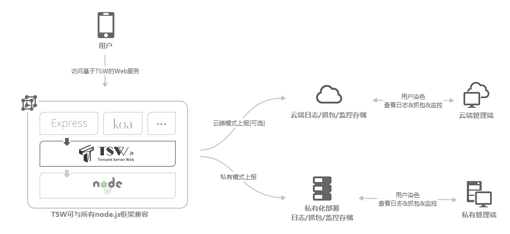

# [Tencent Server Web](https://tswjs.org)


[](./LICENSE) [](https://github.com/Tencent/TSW/pulls) [](https://tswjs.org/guide/index) 

---


[English Version](./README_en.md) 


## 简介

Tencent Server Web(TSW)，是一套面向WEB前端开发者，以提升问题定位效率为初衷，提供染色抓包、全息日志和异常发现的Node.js基础设施。TSW关注业务的运维监控能力，适用于http、websocket协议的业务场景，可无缝与即有项目进行整合。支持公有云、私有云和本地部署。



#### 染色抓包

TSW 支持用户纬度的抓包

- 对于染色的用户
- 对请求生命周期内的抓包进行收集
- 提供抓包查看、下载等功能
- 抓包格式支持Fiddler和Charles，以及HAR

#### 全息日志

TSW 提供用户纬度的全息日志帮助开发者快速定位问题

- 对请求生命周期内的日志，采用全息的方式记录，形成流水
- 流水按用户纬度聚合
- 提供查看功能，快速定位问题原因

#### 异常发现

- 内置指标实时监控
- 代码异常推送告警

## 环境要求

- 操作系统: Windows/Mac/Linux
- Node.js: 8.0.0+

## 开始

1. 请先下载安装[Node.js](https://nodejs.org/en/download/)，并且Node.js的版本需不低于8.0.0。
1. 安装 -- `git clone https://github.com/Tencent/TSW.git`
1. 配置 -- 修改 `TSW/conf/config.js`，更多配置项参考 [手册](https://tswjs.org/doc/api/config) 

    ```js
    this.httpAddress = '0.0.0.0';

    this.httpPort = 80;
    ```

1. 启动 --  ``node TSW``
1. 预览 -- 打开浏览器，访问 ``http://127.0.0.1/`` 即可

## 官方网站

- 更多教程 [https://tswjs.org/guide/index](https://tswjs.org/guide/index)

- 使用手册 [https://tswjs.org/doc/api/index](https://tswjs.org/doc/api/index)

## 配套设施

- TSW开放平台 [https://tswjs.org](https://tswjs.org)

## 贡献代码

如果您使用过程中发现Bug，请通过 [https://github.com/Tencent/TSW/issues](https://github.com/Tencent/TSW/issues) 来提交并描述相关的问题，您也可以在这里查看其它的issue，通过解决这些issue来贡献代码。

如果您是第一次贡献代码，请阅读 [CONTRIBUTING](./CONTRIBUTING.md) 了解我们的贡献流程，并提交 pull request 给我们。

## 许可证

Tencent Server Web 的开源协议为 MIT, 详情参见 [LICENSE](./LICENSE) 。

## 联系方式

tsw@tencent.com