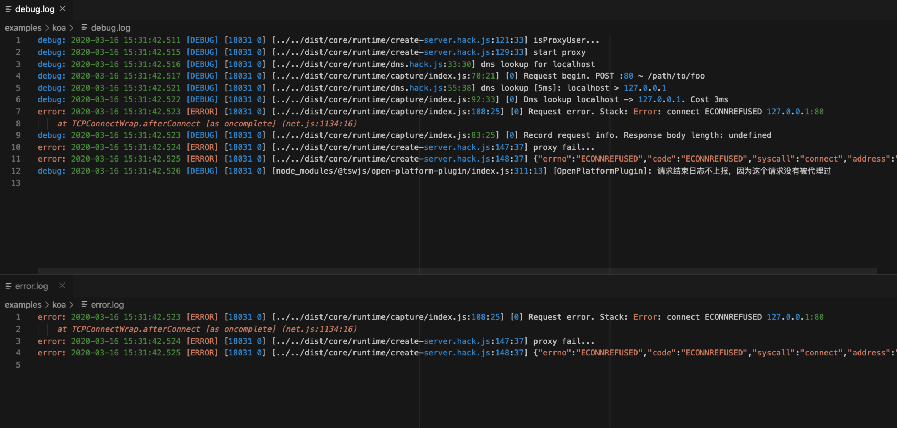
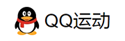

<h1 align="center"><a href="https://tswjs.org">Tencent Server Web 3.0</a></h1>

<p align="center">
  <a href="https://github.com/Tencent/TSW/blob/master/LICENSE"></a>
  <a href="https://github.com/Tencent/TSW/actions?query=workflow%3Abuild"></a>
  <a href="https://vitest.dev/"></a>
  <a href="https://codecov.io/gh/tencent/tsw"></a>
</p>

<h2 align="center">What is it</h2>

Tencent Server Web(TSW) 是一套面向 WEB 前端开发者，以提升问题定位效率为初衷，提供 **染色抓包** 和 **全息日志** 的 Node.js 基础设施。TSW 关注业务的运维监控能力，适用于 http、https 协议的业务场景，可无缝与现有应用（Koa、Express）进行整合。

TSW 2.0 在 1.0 的基础上抽丝剥茧，辅以现代化的设计模式，去除了 1.0 中的大量糟粕，同时对容器化、云原生更加友好。做到了无侵入、低成本接入。

TSW 3.0 在 2.0 的基础上全面拥抱现代化 Node.js 生态：

- **ESM 优先** — 包本身以 ESM 发布，同时完整支持 CJS 和 ESM 用户应用
- **Node.js >= 24** — 利用最新的 V8 引擎和 Node.js 特性
- 使用 AsyncLocalStorage 替代 Domain

<h2 align="center">Highlights</h2>

<table>
  <tr>
    <th><h4 align="center">🚀<h4 align="center">0 侵入</h4 align="center"></th>
    <th><h4 align="center">📒</h4 align="center"><h4 align="center">全息日志</h4 align="center"></th>
    <th><h4 align="center">🛠</h4 align="center"><h4 align="center">请求抓包</h4 align="center"></th>
  </tr>
  <tr>
    <td width="33%">通过 Hack NodeJS 底层代码实现功能。对原有业务代码 0 侵入。</td>
    <td width="33%">按照请求聚类的显微镜级别的全息日志，给开发者完美的现场还原。</td>
    <td width="33%">可抓取 Server 端向外部发送的所有请求的完整包体内容，与后台沟通再无障碍。</td>
  </tr>
</table>

<h2 align="center">从 2.0 迁移到 3.0</h2>

TSW 3.0 包含以下 **Breaking Changes**：

 - **Node.js >= 24** — 不再支持 Node.js 24 以下版本
 - **ESM 包** — `@tswjs/tsw` 现在以 ESM 格式发布（`"type": "module"`），但用户应用不受影响，CJS 和 ESM 均可正常加载
 - **配置文件** — 推荐使用 `export default` 语法（`.mjs` 或在 `"type": "module"` 项目中使用 `.js`）；传统的 `module.exports` 写法仍然兼容
 - **moment 移除** — 如果你的插件依赖了 TSW 内部的 moment，需要自行替换

<h2 align="center">Quick Start</h2>

### 1. 安装
```bash
npm install --save @tswjs/tsw
# yarn add @tswjs/tsw
```
### 2. 添加配置文件  
配置文件是 TSW 启动时加载进运行时的配置文件，主要声明需要使用的 [插件](#plugins) 列表。**默认会加载项目根目录下的 `tswconfig.js` 文件，也可以通过启动参数 `-c` 或者 `--config` 来手动指定配置文件路径。**

TSW 3.0 同时支持 CJS 和 ESM 配置文件：

**ESM 配置（推荐）** — 使用 `.mjs` 扩展名，或在 `"type": "module"` 的项目中使用 `.js`：
```js
// tswconfig.mjs
export default {
  plugins: [
    new MyPlugin({})
  ]
}
```

**CJS 配置** — 传统写法仍然兼容：
```js
// tswconfig.js
module.exports = {
  plugins: [
    new MyPlugin({})
  ]
}
```
**参数列表**:
|    Name     |     Type    |     default    |   Optional  |  Description  |
| :-: | :-: | :-: | :-: | :-: |
|   plugins   | Array<[Plugin](#plugins)>| - |  yes | [插件](#plugins)列表 |
|   cleanLog  | boolean |  `false` |  yes | 是否关闭默认打印 |
|   logLevel  | `DEBUG/INFO/WARN/ERROR` |  `DEBUG` |  yes | 设置 log level |
|   winstonTransports  | Array<[TransportStream](https://github.com/winstonjs/winston-transport/blob/master/index.d.ts)> |  - |  yes | [Winston](#winston-是什么)日志通道 |
### 3. 启动

TSW CLI 支持加载 CJS（`.js`）和 ESM（`.mjs`）入口文件：

```bash
# CJS 入口
npx @tswjs/tsw ./index.js

# ESM 入口
npx @tswjs/tsw ./index.mjs

# 指定 ESM 配置文件
npx @tswjs/tsw -c tswconfig.mjs ./index.mjs
```

**注意事项**：原先 `node --inspect ./index.js` 中的 CLI 参数如 `--inspect` 需要转化为环境变量 `NODE_OPTIONS` 来执行，如 `NODE_OPTIONS="--inspect" npx @tswjs/tsw ./index.js`。

**使用 TypeScript**: 推荐使用 [tsx](https://www.npmjs.com/package/tsx)，它无需额外配置即可支持 ESM + TypeScript：
```bash
NODE_OPTIONS="--import=tsx" npx @tswjs/tsw ./index.ts
```

也可以使用 [ts-node](https://www.npmjs.com/package/ts-node)（ESM 模式）：
```bash
NODE_OPTIONS="--import=ts-node/esm" npx @tswjs/tsw ./index.ts
```
### CLI (Command Line Interface)

使用 `npx @tswjs/tsw --help` 来获取 CLI 选项。

### Examples

我们提供了一些示例项目以让大家尽快了解该项目。

1. `cd ~`
2. `git clone https://github.com/Tencent/TSW.git`
3. `cd TSW`

#### Koa

1. `cd examples/koa`
1. `yarn`
1. `yarn serve` 或者 `npm run serve`
1. `curl -v localhost:4443/path/to/foo -X POST -d "hello, server"`

<h2 align="center">Plugins</h2>

### 插件是什么？

TSW 核心的实现方式是 Hack NodeJS 自身的 `http.request` 以及 `http.createServer`， 以此来实现抓包机制。在服务器处理请求的前后，在服务器向其他服务器发包的前后，等等，都会有相应的事件抛出，以供用户来进行自定义处理。**为了让用户更加方便地复用、传播这样一组组自定义处理，我们将他们抽象出来，形成了插件机制。**

### 一个最简单的插件

```js
export class MyPlugin {
  constructor() {
    this.name = "MyPlugin"
  }

  async init(eventBus, config) {
    eventBus.on("RESPONSE_CLOSE", (payload) => {
      console.log(payload);
    })
  }
}
```

`init` 方法是必须的，这个方法在插件加载开始时会被调用，可以是同步也可以是异步。

#### `eventBus`

`eventBus` 是通过 `new EventEmitter()` 得到的。TSW 核心会在各个关键时机触发上面的事件。

| key | 含义（触发时机） | payload |
| -- | -- | -- |
| `DNS_LOOKUP_SUCCESS` | 在每次 DNS 查询成功之后触发 | `string \| dns.LookupAddress[]` |
| `DNS_LOOKUP_ERROR` | 在每次 DNS 查询失败之后触发 | `NodeJS.ErrorException` |
| `RESPONSE_START` | 在每次服务器开始返回响应（执行 `writeHead`）时触发 | `ResponseEventPayload` |
| `RESPONSE_FINISH` | 在响应结束时（`res.on("finish")`）触发 | `ResponseEventPayload` |
| `RESPONSE_CLOSE` | 在底层链接关闭时 （`res.on("close")`）触发 | `ResponseEventPayload` |
| `REQUEST_START` | 在每次服务器接受到新的请求时触发 | `RequestEventPayload` |


<h2 align="center">Open Platform</h2>

在默认的情况下，TSW 只是会把所有的日志和抓包内容抓取到并且送到事件总线上，以供 [插件](#插件是什么？) 消费。所以将日志和抓包内容落地查看一般需要用户自己编写插件以及提供存储，使用成本过于高昂。  
因此，TSW 官方提供了公共的服务平台 [https://tswjs.org](https://tswjs.org)，让用户低成本、更快、更方便地使用 TSW 的特性，详情见 [开放平台使用指引](./docs/use-open-platform.md)。

<h2 align="center">Cluster</h2>

TSW 面对容器化和云原生设计，没有内置 Cluster 相关功能，推荐直接使用容器的健康检查来完成服务的无损重启和故障重启机制。对于没有使用容器化方案的场景来说，我们推荐使用 [pm2](https://github.com/Unitech/pm2) 类似工具来实现多进程模式。

### pm2

#### 使用 Ecosystem File

```js
// ecosystem.config.json

{
  "apps": [
    {
      "name": "app-name",
      "script": "built/index.js",
      "interpreter": "node",
      "interpreter_args": "./node_modules/@tswjs/tsw/dist/cli.js",
      // other options
    }
  ]
}
```

```js
// package.json

{
  ...
  "scripts": {
    "start": "pm2 start ecosystem.config.json"
  },
  ...
}
```

<h2 align="center">Winston</h2>

### winston 是什么？

`winston` 是一个通用且轻量的日志包。`winston` 支持多个日志通道，并且可以分别定义日志优先级。除了内置的三个日志传输通道[`Console`、 `File`、`HTTP`](https://github.com/winstonjs/winston#common-transport-options)，在 Winston 项目外部还会维护一些[传输模块](https://github.com/winstonjs)。查看 `winston` [官方文档](https://github.com/winstonjs/winston)。

TSW 支持使用 `winston` 传输通道记录日志信息，用户在配置文件中可以添加 `winston.transports` 实例，日志会落到对应配置中。

### 一个简单的示例

使用 `winston` 记录 `error` 级别 以及 `debug` 级别以下的日志信息到对应文件中，当前 `config` 文件配置如下：

```js
import winston from "winston";

export default {
  winstonTransports: [
    new winston.transports.File({ filename: 'error.log', level: 'error'}),
    new winston.transports.File({ filename: 'debug.log', level: 'debug'})
  ]
}
```

**日志记录**



<h2 align="center">Users</h2>

[](https://qzone.qq.com/ "QQ空间")　　　　　　　　[](https://www.weiyun.com/ "腾讯微云")　　　
　  
　  
[](https://fm.qq.com/ "企鹅FM")　　　　[](https://www.weishi.com/ "微视")　　　　　　　　
　  
　  
[](http://vip.qq.com/ "QQ会员")　　　　[](http://egame.qq.com/ "企鹅电竞")　　　　[](http://ac.qq.com/ "QQ动漫")　　　　
　  
　  
[](https://buluo.qq.com/ "QQ兴趣部落")　　　　[](http://now.qq.com/ "NOW直播")　　　　　　　　
　  
　  
　　　　[](http://yundong.qq.com/ "QQ运动")　　　　　　　　
　  
　  
[](https://mp.qq.com/ "QQ公众平台")　　　　[](https://office.qq.com/ "TIM")　　　　[](http://tianqi.qq.com/index.htm "腾讯天气")　　　　
　  
　  
[](https://ke.qq.com/ "腾讯课堂")　　　　[](https://cloud.tencent.com/ "腾讯云")　　　　[](https://y.qq.com/ "QQ音乐")　　　　
　  
　  
[](https://kg.tencent.com/ "全民K歌")　　　　　　　　[](http://e.qq.com/ads/ "广点通")　　　　
　  
　  
[](http://open.qq.com/ "腾讯开放平台")　　　　[](http://kk.qq.com/ "企鹅看看")　　　　[](http://sports.qq.com/ "腾讯体育") 

<h2 align="center">Stargazers over time</h2>

[](https://starchart.cc/Tencent/TSW)

<h2 align="center">License</h2>

Tencent Server Web 的开源协议为 MIT, 详情参见 [LICENSE](https://github.com/Tencent/TSW/blob/master/LICENSE) 。
