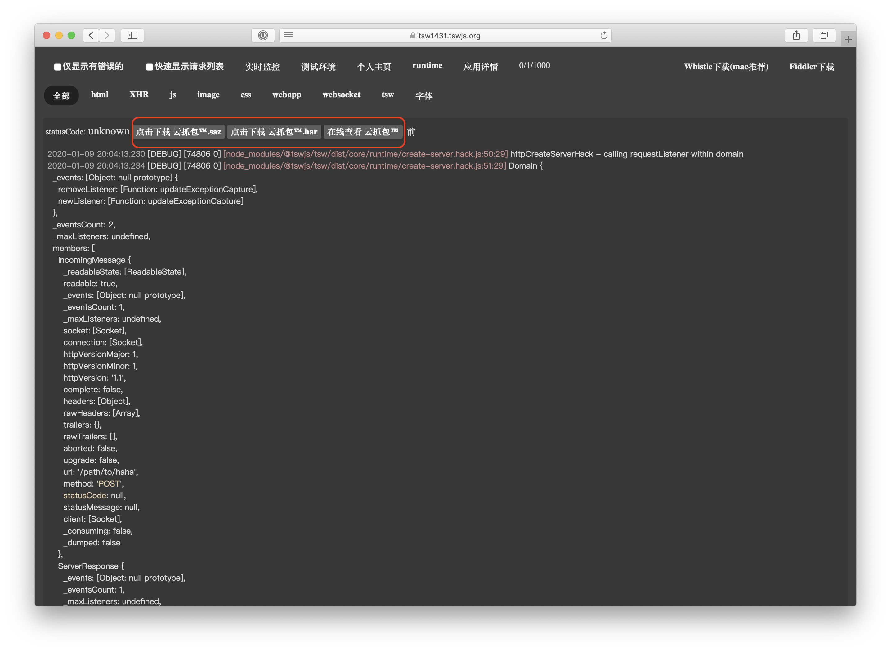

# 使用 TSW 开放平台

使用 TSW 开放平台的具体步骤如下：

1. 登录 https://tswjs.org 并在其上新建一个应用

1. 打开应用，获取 `appid` 和 `appkey`

1. 在项目根目录下新增配置文件 `tswconfig.js`，并参照 [开放平台插件](https://github.com/tswjs/open-platform-plugin) 指引配置完成。

1. 向之前启动的 Koa 或者原生 http server 发送请求，并且在开放平台上查看对应的日志和抓包。查看地址为下方地址拼接而成 `https://domain/log/view/YOUR_UID`

**日志记录**

**在线查看抓包内容**

